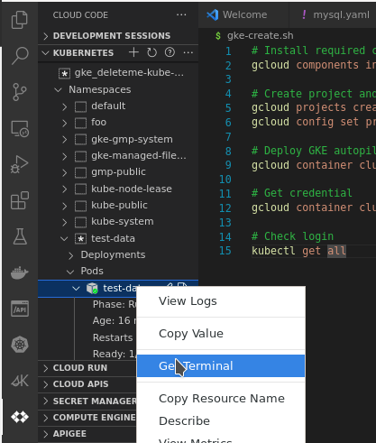

# GKE tutorial

This tutorial will walk you through the steps to create a GKE cluster, deploy a container, and integrate with vscode,
so you can develop and debug your application without leaving your IDE.

## Prerequisites

1. Install [gcloud](https://cloud.google.com/sdk/docs/install)
1. Install gcloud components

    ```bash
    gcloud components install gke-gcloud-auth-plugin kubectl
    ```

## Create GKE autopilot

The file [gke-create.sh](gke-create.sh) will create a GKE autopilot cluster.
If you already have a cluster, you can skip this section.

See [GKE autopilot](https://cloud.google.com/kubernetes-engine/docs/concepts/autopilot-overview) for more details.

## Authenticate to GKE

1. Authenticate to GKE

    ```bash
    gcloud auth login
    ```

1. Install dependencies

    ```bash
    # Get credential
    gcloud container clusters get-credentials --region europe-west1 --project deleteme-kube-autopilot deleteme-autopilot

    # Check login
    kubectl get ns
    ```

## Create an application with a container for data-playground

1. create or set the namespace

    ```bash
    export NS=test-data-playground
    kubectl create ns $NS
    ```

1. create the pods

    ```bash
    export NS=test-data-playground
    kubectl config set-context --current --namespace $NS
    kubectl apply -f data-playground.yaml
    ```

1. connect to the pod

    ```bash
    kubectl exec -it data-playground -- bash
    ```

1. copy files to the pod

    ```bash
    kubectl cp data-playground.yaml data-playground:/data-playground.yaml
    kubectl cp data-playground.py data-playground:/data-playground.py
    ```

## Integrate with vscode (alternative to CLI / cloud shell)

1. Install vscode extension: [Cloud Code](https://cloud.google.com/code/docs/vscode/install)
1. Attach to a kubernetes cluster

    ```vscode
    > Kubernetes: add existing cluster
    ```

1. Inspect resources and get terminal


